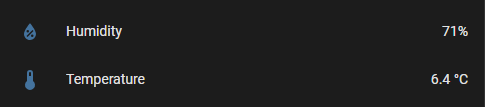
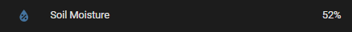

## docker-rtl-433-mqtt

## TL;DR

This is a Go app that runs [RTL_433](https://github.com/merbanan/rtl_433) to get data from Radio signals and flow to MQTT via the [Mosquitto](https://mosquitto.org/) broker.

## What this does

This is a containerized app that will:
- Sends MQTT messages to create topics in a [Mosquitto](https://mosquitto.org/) MQTT broker
- Start reading Radio signals from an [RTL-SDR](https://en.wikipedia.org/wiki/Software-defined_radio) (Realtek Software Defined Radio) antenna using [RTL_433](https://github.com/merbanan/rtl_433)
- Sends messages to MQTT via [Eclipse Paho MQTT Go client](https://github.com/eclipse/paho.mqtt.golang) in a format that can be read by Home Assistant

## Prerequisites

You will need:
- Docker
- Make
- An RTL-SDR USB dongle. I use the `NooElec NESDR Mini USB RTL-SDR` but [RTL_433](https://github.com/merbanan/rtl_433) supports a lot of different models, choose the one that you prefer
- Home Assistant or something on the other side to consume the MQTT messages

## Running

To run this:

1. Create an `.env` file like this.
   This will be used by container to connect to MQTT.
```
MQTT_HOST=<value>
MQTT_PORT=<value>
```

2. Expose the correct RTL-SDR USB dongle to the container
```yaml
devices:
  - /dev/bus/usb/001/005:/dev/bus/usb/001/005
```

3. Run Docker Compose
```shell
make run
```

If everything goes well you will see the sensor states in Home Assistant like this for temperature and humidity outside:



And like this for soil moisture (used for plants):

